# AIカメラを使ってカウントした人数をクラウドで可視化しよう

この記事は、「Raspberry Pi + Picameraでisaaxをはじめよう」の応用編として、AIカメラのサンプルアプリケーションを使ってカウントした人数をクラウドで可視化するところまでを体験します。ハンズオンでは必要なライブラリがあらかじめインストールされたSDカードを手元に配っているのでそちらを使ってください。新しく用意したSDカードに同様の環境を構築したい場合は記事の最後にある付録を確認してください。


## 今回作成するもの

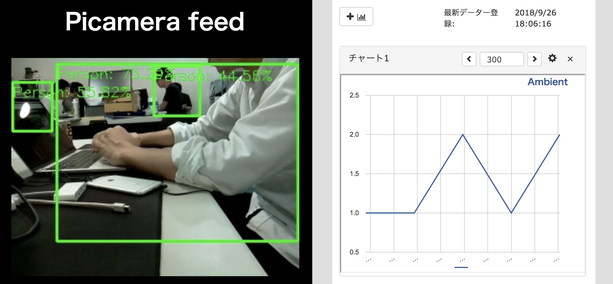

大まかな流れとして、

1. サンプルプログラムをisaaxを使ってインストール
2. GitHub経由でサンプルに機能を追加
3. Ambientでデータの可視化

の順番でハンズオンを進めていきます。


## 用意するもの

このハンズオンで必要となる部材は下記の通りです。


### Raspberry Pi 環境

- Raspberry Pi 2 または 3以上
- SDカード (配布したものを使用)
- Picameraモジュール (v1またはv2)
- 電源 (PCからの給電も可)
- インターネット接続

### PC環境

- SSHが使える環境 (WindowsならTeraTermなど)
- gitが使える環境
- GitHubアカウント
- isaaxアカウント (後述)
- Ambientアカウント (後述)
- インターネット接続

後ほどSSHを行うため、Raspberry PiとPCは同じローカルネットワーク環境下に接続されるようにしてください。


## Ambientアカウントの作成

IoTデータの可視化サービスであるAmbient(アンビエント)にアカウントを登録します。

[Ambient - IoTデータ可視化サービス](https://ambidata.io/)

リンクを開き、右上の「ユーザー登録(無料)」ボタンからアカウントを登録しましょう。入力したアドレスに確認メールが届くので、認証をおこなってください。


## ハンズオンの準備

Raspberry PiにカメラとSDカード、有線接続する場合はLANケーブルを接続し、電源を投入してください。ハンズオンでは電源投入後にIPアドレスを調べます。この時点でRaspberry PiのIPアドレスを控えていない場合は、スタッフをお呼びください。


## サンプルプログラムを動かそう

それでは始めましょう。isaaxを使って人数カウントを行うサンプルプログラムをRaspberry Piにインストールします。GitHubにログインしていない場合は、ここでログインしましょう。


### サンプルコードのフォーク

ブラウザで下記のリンクを開き、右上のForkボタンを押してリポジトリを自分のアカウントにフォークします。

[サンプルコード - GitHub isaaxug/study-picamera-examples](https://github.com/isaaxug/study-picamera-examples)

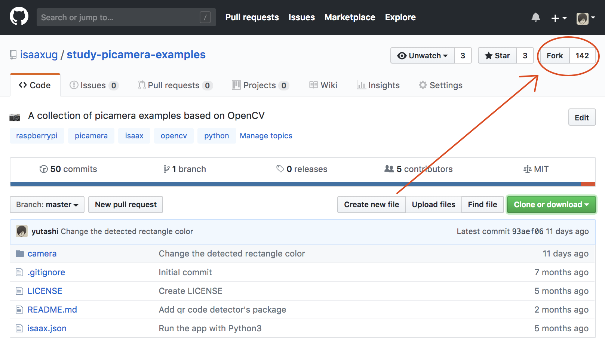

### isaaxプロジェクトの作成

次に、isaaxにGitHubアカウントを使ってログインします。

[isaax.io - 公式ページ](https://isaax.io/)

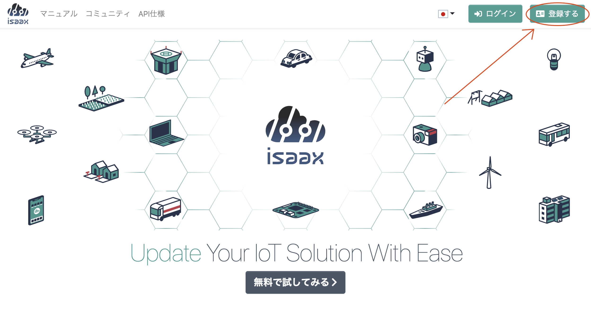
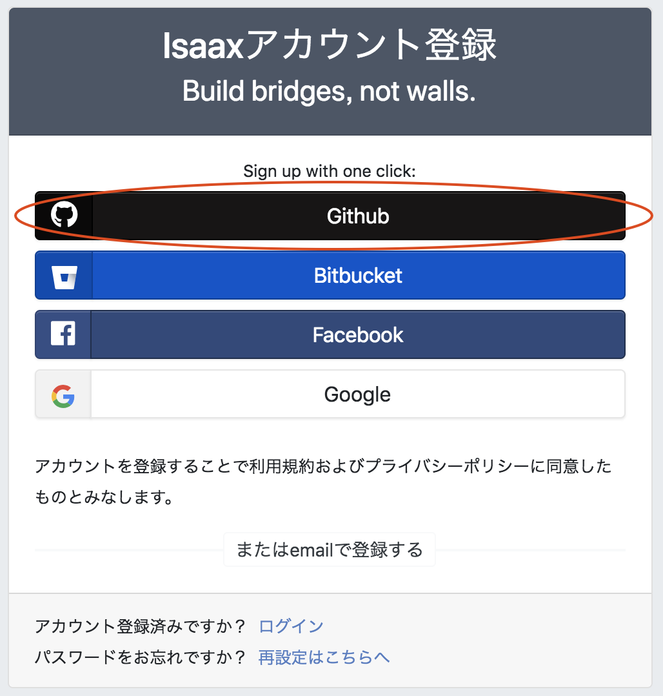

isaaxのダッシュボードを開き、「+ 新規プロジェクト追加」からプロジェクトを作成します。

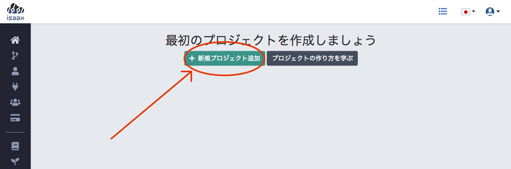

下図のようにプロジェクトを設定し、「保存」をクリックします。

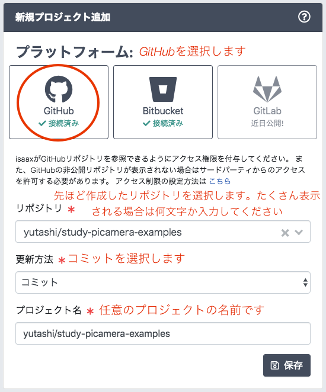


### デバイスの登録

プロジェクトの作成後、下図のような画面が表示されます。プロジェクトトークンはデバイスにisaaxdをインストールする際に必要となります。インストールスクリプトはそのトークンを引数としてisaaxdのインストールをワンコマンド実行するためのスクリプトです。下の方の文字列をコピーしてください。

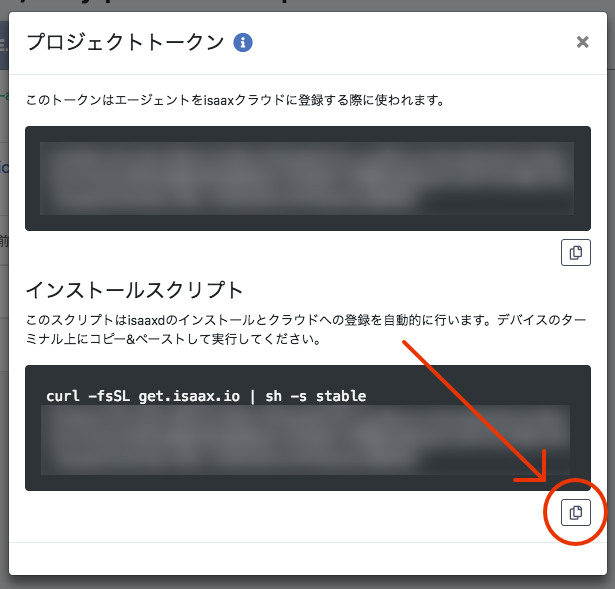

Raspberry PiにSSH接続します。`<>`は入力しないでください。

```
$ ssh pi@<Raspberry PiのIPアドレス>
```

ログインしたら、コピーした文字列をラズパイ上で実行します。`isaaxd installation complete`が表示されればインストール成功です。

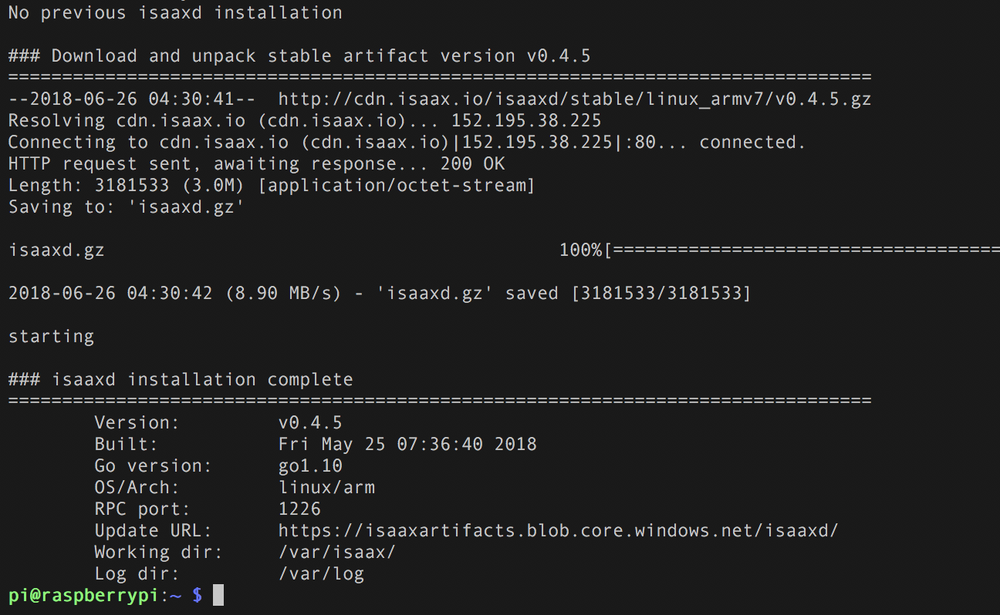


### 動作の確認

ブラウザからRaspberry Piの<IPアドレス>:5000にアクセスするとPicameraの映像が確認できます。このアプリケーションは、フレーム内の人の位置、数を認識し、ログとして人数を出力します。そのログの様子はisaaxのダッシュボードから登録したデバイスのページから確認できます。

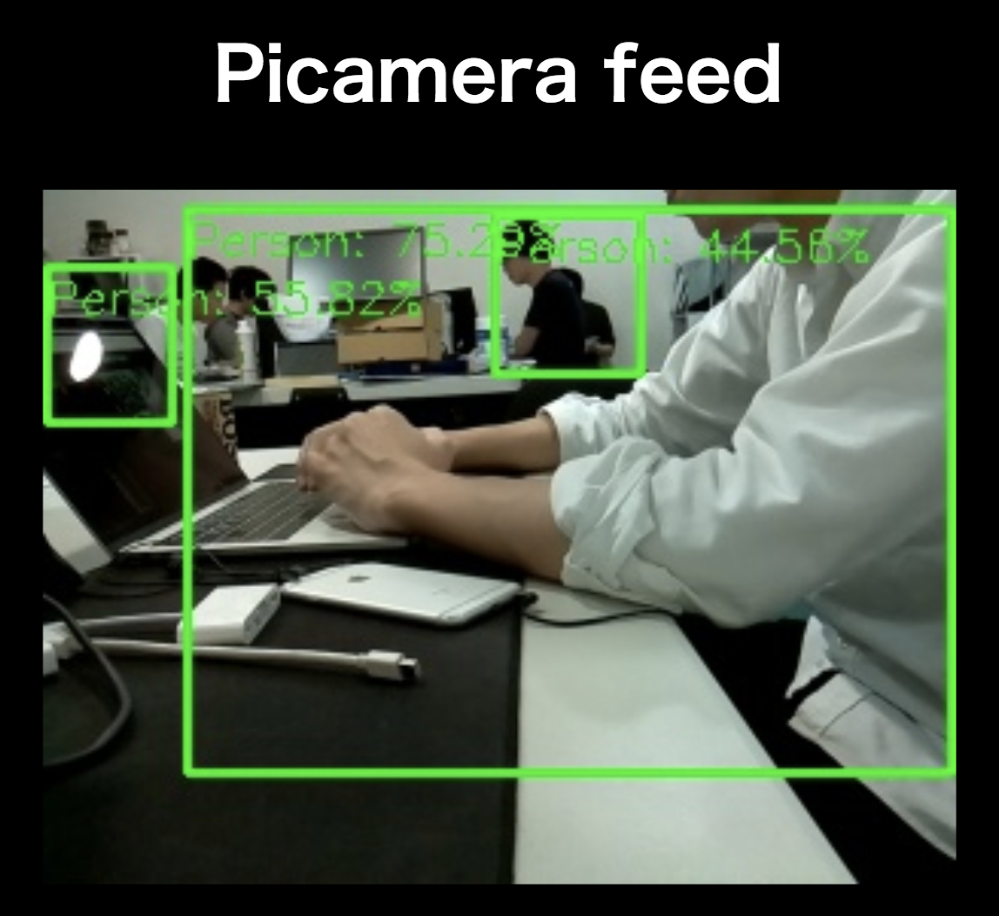

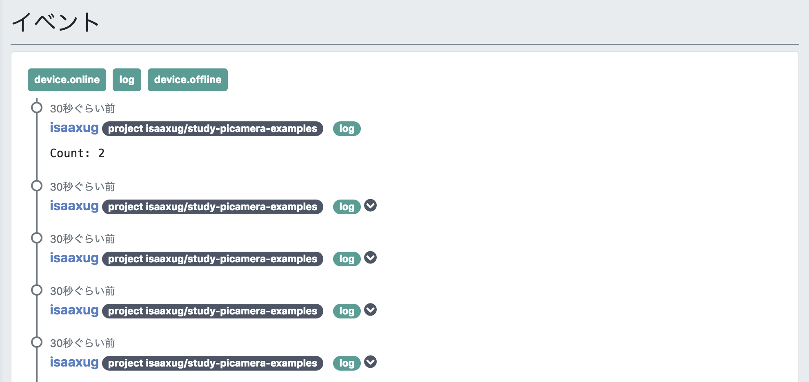


## Ambientとの連携

現時点で、フレーム内の人数を数えるところまでは成功しています。このデータをクラウドに送信して可視化し、どの時間帯に人が認識されたのか確認できるように機能を追加しましょう。


### Ambientクライアントの作成

フォークしたリポジトリを自分のPCにクローンし、お好きなエディタを開いてコーディングしていきます。gitを使い慣れていない場合はGitHub上で直接コードを編集してください。編集するファイルは `camera/processor/person_detector.py` です。

はじめに、必要なモジュールをインポートします。

```python
from datetime import datetime
import ambient
import os
import sys
```

データを指定のAmbientチャネルに送るためのIDを環境変数から取得します。チャネルの作成と環境変数のセットは以降のセクションで行います。例外処理として、環境変数が存在しなかった場合はエラーメッセージを表示してプログラムを終了させるようにします。

```python
try:        
    AMBIENT_CHANNEL_ID = int(os.environ['AMBIENT_CHANNEL_ID'])
    AMBIENT_WRITE_KEY = os.environ['AMBIENT_WRITE_KEY']
except KeyError as e:
    sys.exit('Couldn\'t find env: {}'.format(e))
```

Ambientのクライアントとなるオブジェクトを作成します。

```python
am = ambient.Ambient(AMBIENT_CHANNEL_ID, AMBIENT_WRITE_KEY)
```

実際にAmbientにデータを送信する処理を記述します。`PersonDetector`クラスの前に定義します。カウントした人数を引数として受け取り、データを送信します。

```python
def request(count):
    am.send({
        'created': datetime.now().strftime('%Y-%m-%d %H:%M:%S'),
        'd1': count,
    })
```

80行目付近のifブロックはカウントが0より大きかった場合にその人数を表示する処理です。このブロック内に上で定義した`request`関数を呼び出しましょう。


```python
if count > 0:
    print('Count: {}'.format(count))
    request(count)
```

Ambientの最短の送信間隔は5秒なので、今回は余裕を持たせて30秒ほど間隔をあけます。はじめに`PersonDetector`の`__init__`メソッドにデータを送信した時間を保持するための変数を追加します。

```python
def __init__(self, flip = True):
    self.last_upload = time.time()
    self.vs = PiVideoStream(resolution=(800, 608)).start()
    self.flip = flip
    time.sleep(2.0)
```

先ほどのifブロックに戻り、最後にデータを送信してから30秒経過している場合に送信処理を行うように変更します。

```python
if count > 0:
    print('Count: {}'.format(count))
    elapsed = time.time() - self.last_upload
    if elapsed > 30:
        request(count)
        self.last_upload = time.time()
```

編集は以上です。最終的なコードの全体像は下記のリンクから確認してください。

[サンプルコード - GitHub](https://github.com/isaaxug/study-picamera-examples/blob/answer-0927/camera/processor/person_detector.py)

変更を終えたら、コミットを作成してリモートリポジトリに反映します。GitHub上で編集した場合はページ下部の「Commit changes」ボタンからコミットを作成できます。リモートリポジトリに変更があると、isaaxは更新通知を受け取り、自動的に先ほど登録したデバイスに対して最新のアプリケーションを配信します。

isaaxのダッシュボードからログを確認してみましょう。下記のようなエラーが表示されるはずです。

```
Couldn't find env: 'AMBIENT_CHANNEL_ID'
```

現時点では、必要な環境変数とその値が存在しないためこのような表示となります。以降のセクションでこの値を設定します。

> isaaxでは、デバイスに配信されたアプリケーションはSystemdのサービスとして登録されます。もしアプリケーションが何らかの理由でエラーとなった場合、2分後にアプリケーションを再起動しようと試みます。


### チャネル作成

Ambientアカウントにログイン後、「Myチャネル」-> 「チャネルを作る」ボタンからチャネルを新規作成します。

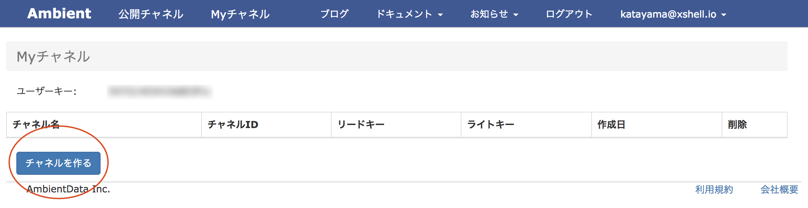

作成したチャネル情報の中から、データを保存するために「チャネルID」と「ライトキー」を後ほど使います。

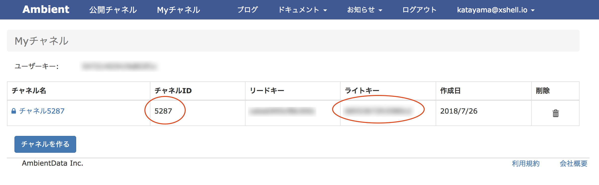


### 環境変数の追加 (チャンネルID、ライトキー)

更新するサンプルアプリケーションがAmbientにデータを送信するために、チャネルIDとライトキーが必要となります。これらの情報をisaaxのユーザー変数に登録します。ユーザー変数とはisaaxの機能のひとつで、APIキーのような認証情報や環境によって異なるエンドポイントなど、ハードコーディングしたくないデータを切り分けてデプロイする機能があります。isaaxで登録したこのデータはデバイス上で環境変数としてアクセスできます。

クラスターページから「Cluster Settings」をクリックしてドロップダウンを開きます。

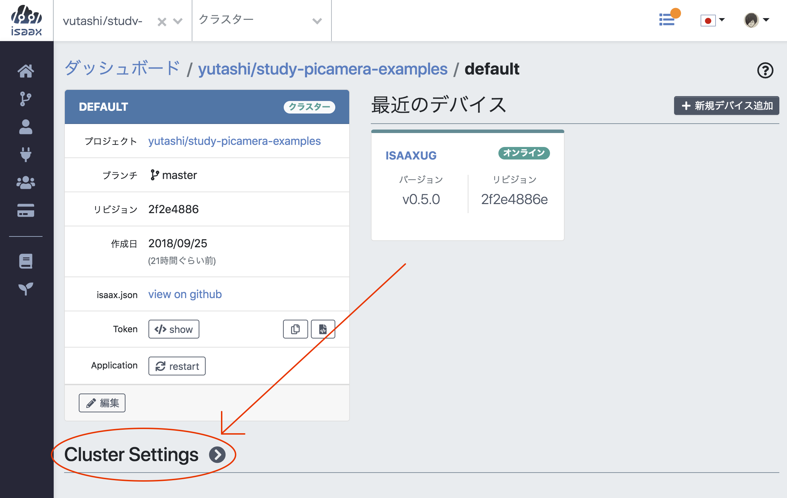

「ユーザー変数」タブから「＋環境変数追加」をクリックします。

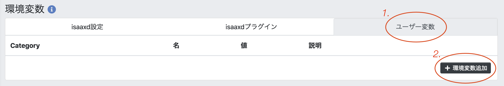

先ほど追加したコードでは、アプリケーション内で`AMBIENT_CHANNEL_ID`と`AMBIENT_WRITE_KEY`の2つの環境変数を参照していました。なので、それらと同じ名前で変数を追加します。

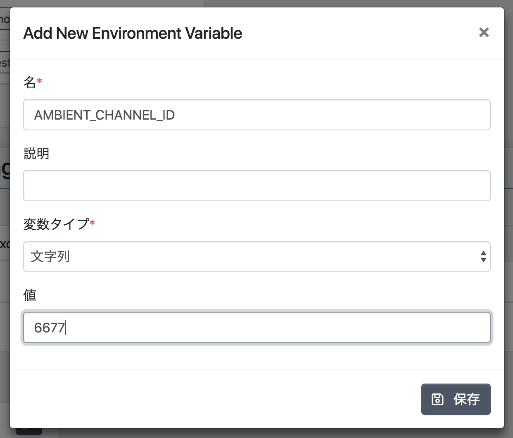

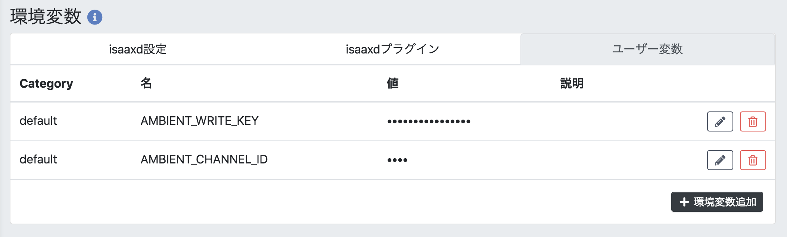

環境変数の追加を反映するために、デバイス上のアプリケーションを再起動します。下図を参考にクラスターページの「restart」ボタンから再起動をおこなってください。


しばらく人数の認識を行わせた後にAmbientで作成したチャンネルのページに移動すると、グラフで可視化されている様子を確認できます。

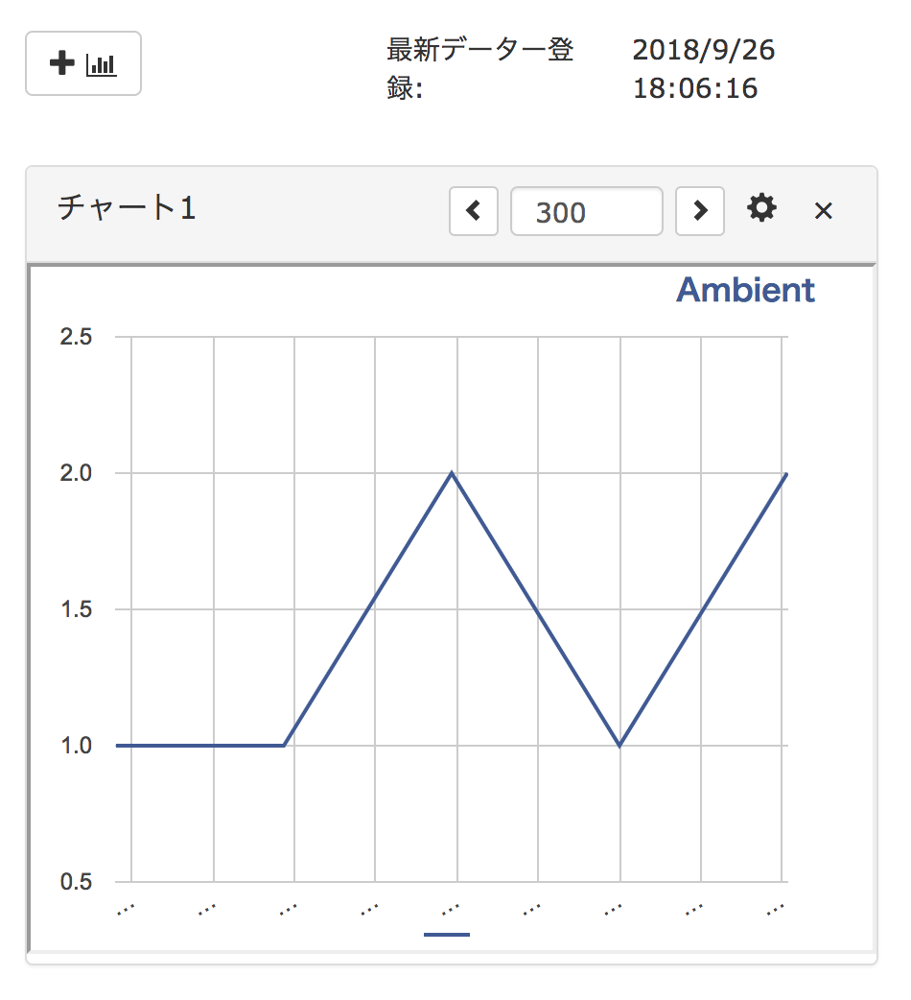


## 課題

## 付録 SDカードのセットアップ

新しくRaspbian liteのOSイメージを焼いたSDカードを使う場合は、以下のライブラリをインストールしてください。

```
$ sudo apt update && sudo apt upgrade
$ sudo apt install python3-pip

$ pip3 install picamera numpy opencv-python
$ pip3 install git+https://github.com/AmbientDataInc/ambient-python-lib.git

$ sudo apt install libatlas-base-dev
$ sudo apt install libwebp6 libtiff5-dev libjasper-dev
$ sudo apt install libopenexr22 libilmbase12
$ sudo apt install libgstreamer1.0-dev
$ sudo apt install libavcodec-dev libavformat-dev libswscale-dev
$ sudo apt install libqtgui4 libqt4-test
```

下記のコマンドを実行して、`opencv-python`が使える状態になっていることを確認します。バージョン番号が表示されれば正しくインストールされています。

```
$ python3 -c "import cv2; print(cv2.__version__)"
3.4.2
```
